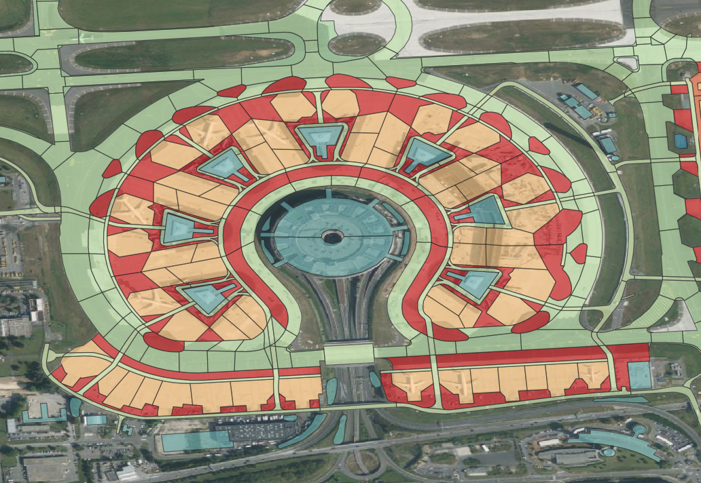

# raster2ML

<p align="center">
    
</p>


## Purpose

`raster2ML` is a utility designed to process a Raster file and its corresponding shapefile to produce a raster mask file. The mask assigns class names based on the specified field in the shapefile.

## Output

The result is an 8-bit PNG file where a different color represents each distinct class from the shapefile.

## Usage

### 1. raster2png:

Converts a Raster image into an 8-bit PNG.

**Command**:
```bash
test_raster2png.py [-h] src_raster output_folder
```

**Example**:
```bash
!python tutorial/test_raster2png.py tutorial/in_folder/myraster.tif tutorial/out_folder
```

[View Source Code](https://github.com/spatiallysaying/raster2ML/blob/main/examples/test_raster2png.py)

### 2. shp2labelme:

Generate a `labelme` JSON structure using raster and shapefile data.

**Command**:
```bash
test_shp2labelme.py [-h] raster_file shapefile_path label_field
```

**Example**:
```bash
!python tutorial/test_shp2labelme.py tutorial/out_folder/myraster_8bit.png tutorial/in_folder/myvector.shp idlin
```

[View Source Code](https://github.com/spatiallysaying/raster2ML/blob/main/examples/test_shp2labelme.py)

### 3. labelme2mask:

Defines a set of functions that transform a given `labelme` JSON file into a labeled image (mask).

**Command**:
```bash
test_labelme2mask.py [-h] source_json_file target_folder
```

**Example**:
```bash
!python tutorial/test_labelme2mask.py tutorial/out_folder/myraster_8bit.json tutorial/out_folder
```

[View Source Code](https://github.com/spatiallysaying/raster2ML/blob/main/examples/test_labelme2mask.py)

## Dependencies

Ensure you have all the necessary dependencies installed. Refer to `requirements.txt` for a list of required packages.
